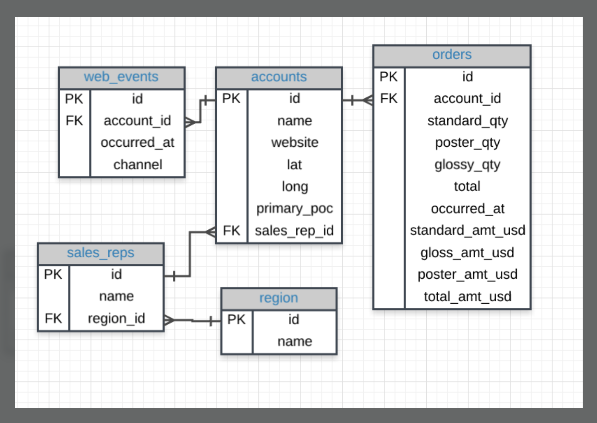

# SQL-for-Data-Analysis

This repository contains the quizzes along with their SQL commands for the concepts taught in the course [SQL for Data Analysis](https://in.udacity.com/course/sql-for-data-analysis--ud198) by [MODE](https://modeanalytics.com) at [Udacity](http://udacity.com/).

You can restore the toy dataset  "parch and posey" to your local machines from the file **parch_and_posey_db** using the following steps:

1. Open Terminal.
2. Enter PostgreSQL console - `psql` 
3. Create a new database - `CREATE DATABASE parch_and_posey;`
4. Restore into the database - `pg_restore -d parch_and_posey /path/to/parch_and_posey_db`

**NOTE: The data dump file and the above commands works well with PostgreSQL (may or may not work with MySQL and others).**

Now, SQL commands can be used to explore the dataset and run queries on it.

 
Here is the schema of the database used for all the queries.

 
I have also included the screenshots from the videos for some important and useful concepts that may need revision in future.

For the remaining ones, please refer these [SQL Tutorials](https://community.modeanalytics.com/sql/) (by MODE as well).

